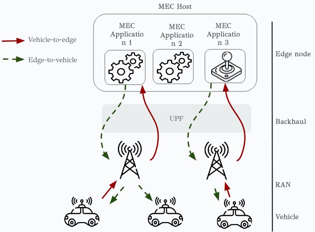
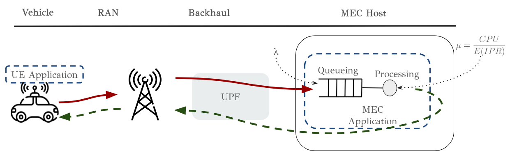
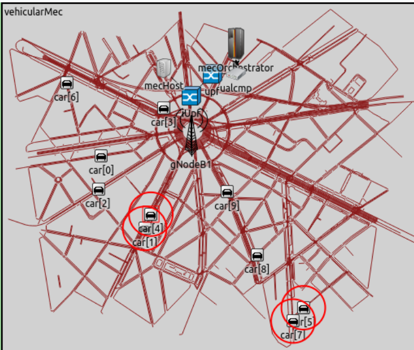

TODO: write tutorial

#  README

This repository is a forked from Simu5G(https://github.com/Unipisa/Simu5G.git) project.
We add a scenario featuring Connected vehicles and MEC. We implemented a parametric "vehiclar" service aiming to mimic the behaviour of real world "application".
This service is composed by a UEApplication and a MECApplication as shown in our model: 

The parameters of this service can be change in order to adapt to experimenteur needs. Tunable parameters are the following:  

- Uplink
  - payload size --> The size of the payload at the applicaiton level
  - Inter sending time 
- Downlink
  - payload size --> The size of the payload at the applicaiton level
  - Inter sending time(for synchronous model) or always answering (for asynchronous model)
- Processing: Millions Instructions associated to each received request 
- Dissemination radius for cooperative applicaitons. This type of applicaiton correspond to applicaiton n°1 as shown in the following figure, where the edge process sensed data and retrieve them to a certain area arround the vehicle that is performing a cooperative service.

## Our Model 

## Our Goal

## Exemple of simulations

Here is the default example:

## Requirements 
This repo has the same requirements than Simu5G. 

## Installation 
### Graphical installation (easy)
- Clone repo
- Import the repo
- Add feature
- Add reference
- Build repo(attention to builder)
### CLI installation (less easy)
- . setenv
- make makefiles 
- make MODE=debug all (attention)

## Compatibility 
