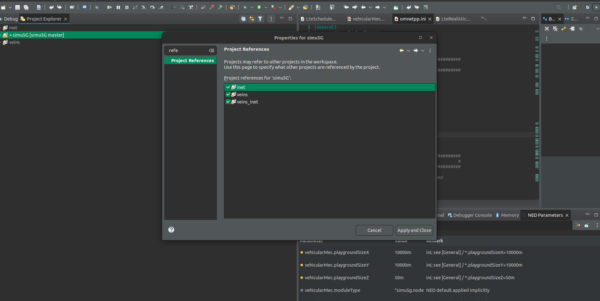

TODO: write tutorial

#  README

This repository is a forked from Simu5G(https://github.com/Unipisa/Simu5G.git) project.
We add a scenario featuring Connected vehicles and MEC. We implemented a parametric "vehiclar" service aiming to mimic the behaviour of real world "application".
This service is composed by a UEApplication and a MECApplication as shown in our model: 

The parameters of this service can be change in order to adapt to experimenteur needs. Tunable parameters are the following:  

- Uplink
  - payload size --> The size of the payload at the applicaiton level
       - Can be modified in the ini file 
        https://github.com/zazim13/Simu5G-MecBasedAV/blob/5284bb357f1e9413ce2399cb2ba85387022a1069/simulations/NR/mec/vehicularMec/omnetpp.ini#L268
         
       - The code corresponding can be found here:
         https://github.com/zazim13/Simu5G-MecBasedAV/blob/46be7c3a4f5ccf6b3a294887d2605b4873e6392a/src/apps/PingPong/UEPingPongApp.cc#L642
         
  - Inter sending time
        
       - Can be modified in the ini file with the following parameter
         https://github.com/zazim13/Simu5G-MecBasedAV/blob/ebe81de55d23403e72c62e5251d1054ef4bd9da8/simulations/NR/mec/vehicularMec/omnetpp.ini#L268
        
         
       - The code corresponding can be found here:
         https://github.com/zazim13/Simu5G-MecBasedAV/blob/46be7c3a4f5ccf6b3a294887d2605b4873e6392a/src/apps/PingPong/UEPingPongApp.cc#L291
         
- Downlink
  - The payload size at the application level to send to the sending car:
     https://github.com/zazim13/Simu5G-MecBasedAV/blob/ebe81de55d23403e72c62e5251d1054ef4bd9da8/src/apps/PingPong/MECPingPongApp.cc#L746
  - The payload size at the application level to send to neighboring cars: 
    https://github.com/zazim13/Simu5G-MecBasedAV/blob/ebe81de55d23403e72c62e5251d1054ef4bd9da8/src/apps/PingPong/MECPingPongApp.cc#L628

    
- Processing: Millions Instructions associated to each received request
  https://github.com/zazim13/Simu5G-MecBasedAV/blob/ebe81de55d23403e72c62e5251d1054ef4bd9da8/src/apps/PingPong/MECPingPongApp.cc#L108
  
- Dissemination radius for cooperative applications. This type of application corresponds to application n°1, as shown in the following figure, where the edge process senses data and answers to a certain area around the vehicle that is performing cooperative service.
  https://github.com/zazim13/Simu5G-MecBasedAV/blob/ebe81de55d23403e72c62e5251d1054ef4bd9da8/simulations/NR/mec/vehicularMec/omnetpp.ini#L272

## Our Model 

## Exemple of simulations

Here is a simulation example:

## Requirements 
This repo has the same requirements than Simu5G. 

## Installation 
### Graphical installation 
- Clone this repository
- Import it to your workplace
    - File | import | Project from folder or archive
    - Select this repo and add it
- Add Simu5G Cars features
    - right clic on repo | properties
      
- Add references to dependencies(inet, veins, veins_inet)
    -  right clic on repo | properties 
     
- Build the project using the same builder than inet, vein and veins_inet
     - right clic on repo | Build project
        
### CLI installation
- . setenv
- make makefiles 
- make MODE=debug all (attention to builder)

## Compatibility 
